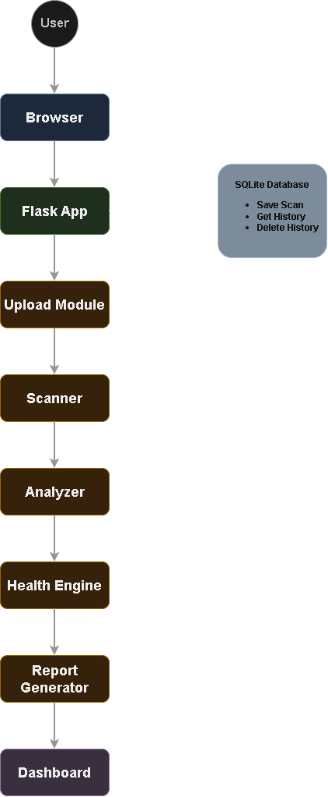
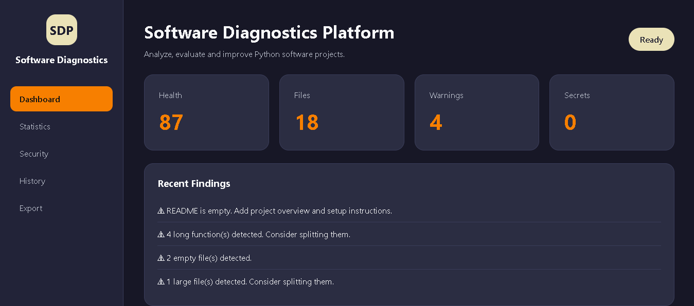
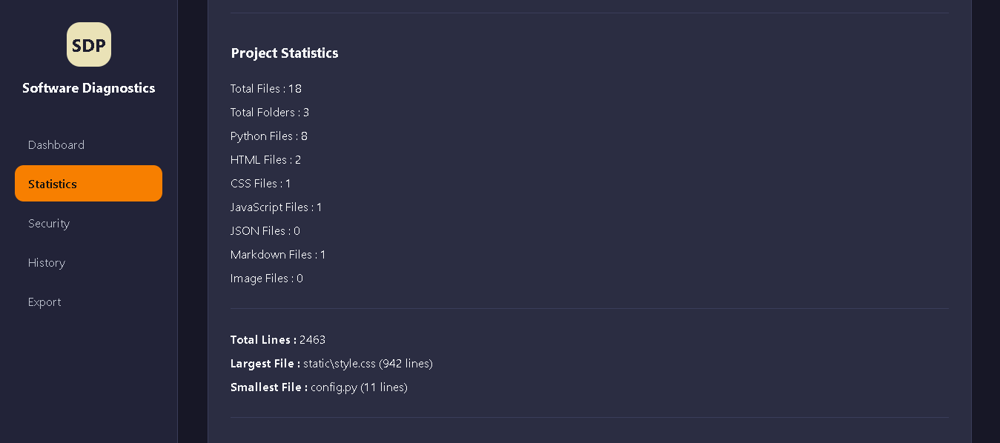
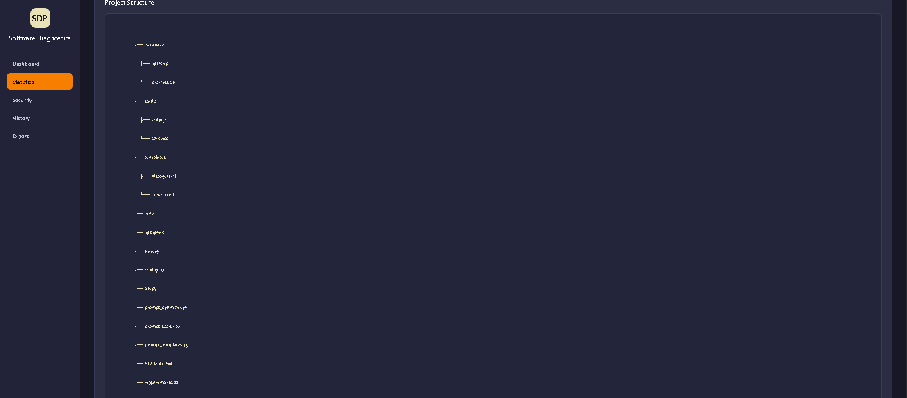
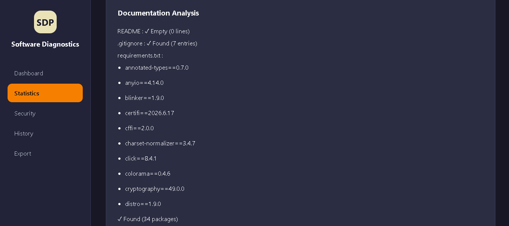
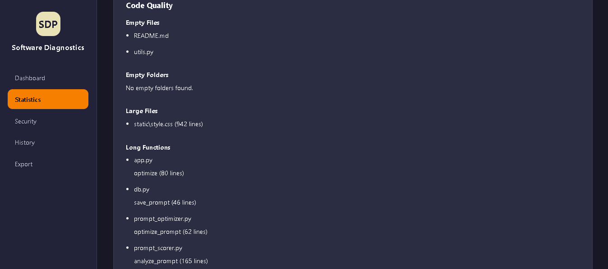
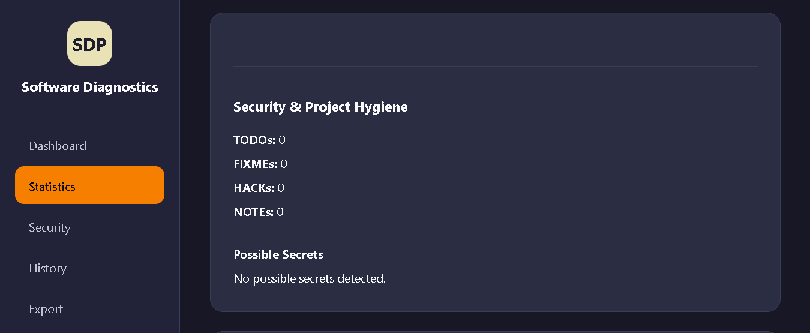
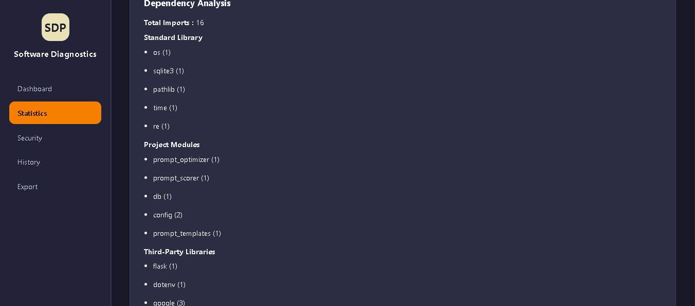
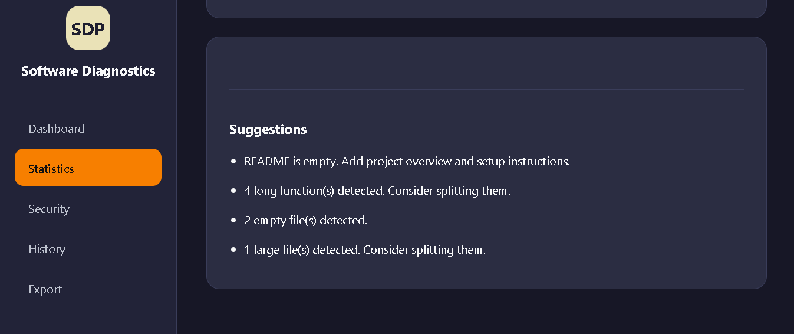
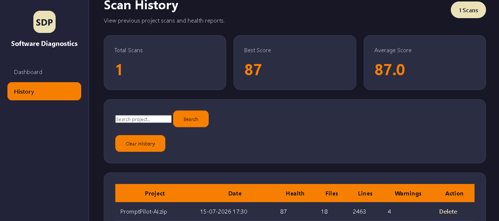

# Software Diagnostics Platform (SDP)

A professional web-based platform that analyzes Python software projects, evaluates code quality, detects potential security issues, calculates project health scores, generates reports, and maintains scan history.

---

## Overview

Software Diagnostics Platform (SDP) helps developers quickly understand the quality, structure, maintainability, and security of Python projects.

The platform scans uploaded Python projects, performs automated analysis, and presents findings through a modern dashboard.

---

## Features

### Project Scanning

- Upload Python projects as ZIP files
- Automatically extract project contents
- Analyze project structure

### Project Statistics

- Total Files
- Total Folders
- Python Files
- HTML Files
- CSS Files
- JavaScript Files
- JSON Files
- Markdown Files
- Image Files
- Total Lines of Code
- Largest File
- Smallest File

### Documentation Analysis

- README Detection
- README Status Analysis
- .gitignore Detection
- requirements.txt Detection

### Code Quality Analysis

- Empty File Detection
- Empty Folder Detection
- Large File Detection
- Long Function Detection
- Long Class Detection
- Duplicate Filename Detection

### Security & Project Hygiene

- TODO Detection
- FIXME Detection
- HACK Detection
- NOTE Detection
- Possible Secret Detection
- Hardcoded Credential Detection

### Dependency Analysis

- Standard Library Imports
- Project Module Imports
- Third-Party Library Imports
- Total Import Count

### Health Score Engine

Calculates project health using:

- Documentation Score
- Maintainability Score
- Security Score
- Organization Score
- Dependency Score

Generates:

- Overall Health Score
- Score Explanations
- Improvement Reasons

### Suggestions Engine

Automatically generates recommendations such as:

- Missing Documentation
- Long Functions
- Empty Files
- Security Risks
- Large Files

### Report Export

Generate reports in:

- JSON
- Markdown
- PDF

### Scan History

- Save Scan Results
- Search Scan History
- Delete Individual Scans
- Clear Scan History
- SQLite-Based Storage

---

## Technology Stack

### Backend

- Python
- Flask
- SQLite
- AST
- Regex

### Frontend

- HTML
- CSS
- JavaScript

### Database

- SQLite

### Report Generation

- JSON
- Markdown
- PDF

---

## Architecture




---

## Project Structure

```text
Software-Diagnostics-Platform/
│
├── app.py
├── scanner.py
├── analyzer.py
├── score_engine.py
├── exporter.py
├── history_db.py
│
├── templates/
│   ├── index.html
│   ├── history.html
│   └── sections/
│
├── static/
│   ├── css/
│   └── js/
│
├── uploads/
├── reports/
│
├── requirements.txt
├── README.md
└── .gitignore
```

---

## Installation

### Clone Repository

```bash
git clone https://github.com/karthik-k11/software-diagnostics-platform
cd Software-Diagnostics-Platform
```

### Create Virtual Environment

```bash
python -m venv venv
```

### Activate Environment

Windows:

```bash
venv\Scripts\activate
```

Linux/Mac:

```bash
source venv/bin/activate
```

### Install Dependencies

```bash
pip install -r requirements.txt
```

---

## Running the Application

```bash
python app.py
```

Open:

```text
http://127.0.0.1:5000
```

---

## How It Works

### Step 1

Upload a ZIP file containing a Python project.

### Step 2

The platform extracts and scans the project.

### Step 3

Statistics are generated.

### Step 4

Quality, security, dependency, and documentation analysis are performed.

### Step 5

Health scores are calculated.

### Step 6

Suggestions are generated.

### Step 7

Results are displayed on the dashboard.

### Step 8

Reports can be exported as JSON, Markdown, or PDF.

### Step 9

Scan history is stored in SQLite.

---

## Example Analysis Output

```text
Health Score: 81/100

Documentation: 60/100
Maintainability: 80/100
Security: 70/100
Organization: 94/100
Dependencies: 100/100

Suggestions:

- README is empty
- 4 long functions detected
- 2 empty files detected
- 3 possible secrets detected
- 1 large file detected
```

---

## Screenshots

### Dashboard Overview



---

### Project Statistics



---

### Project Structure



---

### Documentation Analysis



---

### Code Quality Analysis



---

### Security Analysis



---

### Dependency Analysis



---

### Health Score


---

### Suggestions



---

### Scan History

